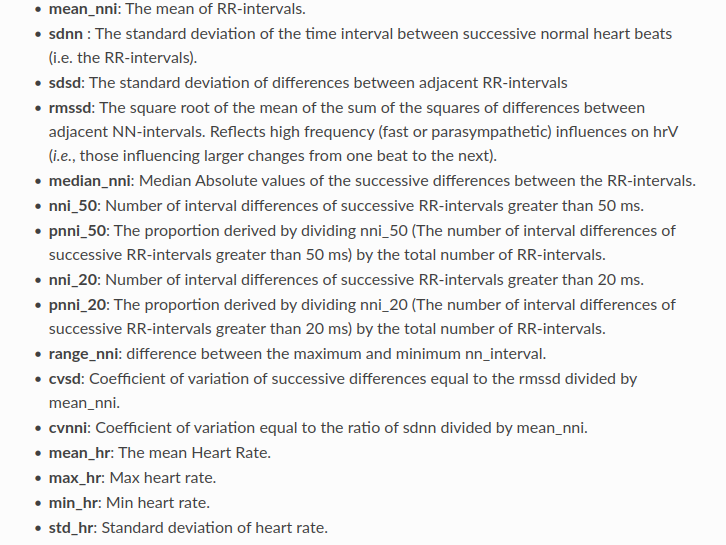

# Sleep Phases Detection - data prepartion

## Introduction

This project involves ECG data preparation for training the Machine Learning model for sleep classifying task. It is a part of research that I took 2 years ago.
## Project Description

This project processes raw ECG data to extract features that are indicative of different sleep phases. The workflow includes loading ECG data from EDF files, preprocessing the data, performing heart rate variability (HRV) analysis, and generating features that can be used for machine learning models. The ultimate goal is to classify sleep phases accurately based on these features.

## Workflow

1. **Data Preparation**: Load and preprocess ECG data from EDF files.
2. **Feature Extraction**: Perform HRV analysis to extract relevant features.
3. **Annotations**: Process sleep scoring files to obtain ground truth labels.
4. **Plotting**: Visualize ECG data with detected R-peaks.
5. **Statistical Analysis**: Calculate statistical metrics for the extracted features.

## Features


The features extracted from the ECG data include various time-domain and frequency-domain HRV indices, as well as additional statistical metrics. These features are used to train machine learning models to classify sleep phases.

## How to Run the Project

### Prerequisites

Ensure you have the following installed:
- Python 3.x

### Installation and running

1. Clone the repository:
   ```sh
   git clone https://github.com/yourusername/sleep-phases-detection.git
   cd sleep-phases-detection
    ```
2. Create virtual enviroment and activate it:
    ``` sh
    python3 -m venv env
    source env/bin/activate
    ```
3. Install requirements.txt
    ```sh
    pip install -r requirements.txt
    ```
4. Update config in config/pipeline folder up to your requirements
5. Run pipeline:
    ```sh
    python3 pipeline.py +pipeline=ecg_data_preparation
    ```

### Resources

Used database and annotations: https://physionet.org/content/hmc-sleep-staging/1.1/

### Contribution

Feel free to contact me to contribute to the project!£